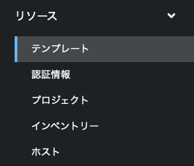
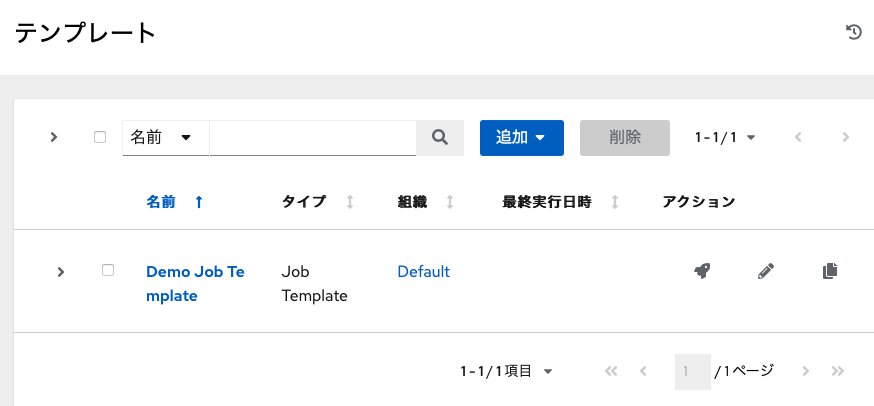
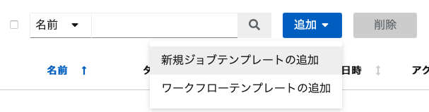
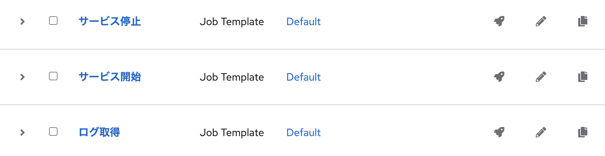

**<<Playbook のセルフサービス化、API化>>**

以下の手順に従い、演習環境を進めてください。

> 左側のウインドのロードに少し時間がかかる場合があります。表示されるまで少々お待ち下さい。

↓をクリックすると次の手順が展開されます。

☑️ タスク1: Automation Controller へのログイン
===
演習画面の左上部のタブから `Dashboard` を選択し、Ansible Automation Platform のログイン画面を表示します。以下の情報でログインを行います。

ユーザー名：
```
admin
```

パスワード：
```
ansible123!
```

今後は、この Ansible Automaton Platform の画面を操作していきます。

> Note: 表示される画面の言語はブラウザの言語設定によって変わります。今後の説明は「日本語」設定の場合を想定して説明をしていきます。それ以外の言語の方はその都度読み替えてください。


☑️ タスク2: ジョブテンプレートの作成1
===
それではPlaybookを実行するための「ジョブテンプレート」を作成します。まずはログ収集を行うジョブテンプレートを作成します。

画面左側メニューの「リソース」配下の「テンプレート」をクリックします。ここには定義済みのジョブテンプレートが表示されます。



画面の「追加」ボタンをクリックし、「新規ジョブテンプレートの追加」を選択します。これでジョブテンプレートの作成画面を表示することが可能です。





ジョブテンプレートを以下のパラメーターで作成してください。指示のない項目に関してはデフォルトのままにしてください。

| 項目           | 設定値               | 備考                             |
|----------------|----------------------|----------------------------------|
| 名前           | ログ取得             |                                  |
| インベントリー | Workshop Inventory   | 自動化の対象を指定               |
| プロジェクト   | Workshop Playbooks   | Playbook の格納先を指定          |
| Playbook       | mvp/get_logfile.yaml | 実行する Playbook を指定         |
| 認証情報       | Host01 Credential    | 自動化の対象へ認証する情報を指定 |

> Note: 上記の設定項目で使用している、 `Workshop Inventory` `Workshop Playbooks` `Host01 Credential` は、予め演習環境に合わせたものが作成されています。

入力が完了したら「保存」ボタンをクリックして設定を保存します。これで「ログ取得」ジョブテンプレートが作成されました。

☑️ タスク3: ジョブテンプレートの実行1
===
作成したジョブテンプレートを実行してみましょう。

画面左側メニューの「リソース」配下の「テンプレート」をクリックします。ここには定義済みのジョブテンプレートが表示されますので、先程作成した「ログ取得」のジョブテンプレートが表示されているはずです。

「ログ取得」ジョブテンプレートの右側に **ロケットアイコン** が表示されています。これがジョブテンプレートの実行ボタンになります。早速、このロケットアイコンをクリックしてジョブテンプレートを実行してください。


実行すると画面が切り替わり、ジョブの実行ログが表示されます。ここで先のステップでコマンドで実行したのと同じようにログが表示されれば成功です。

☑️ タスク4: ジョブテンプレートの作成2
===
さらにジョブテンプレートを追加していきましょう。以下の2つのジョブテンプレートを作成してください。先に作成したジョブテンプレートと名前と実行する Playbook 以外は全て同じ設定になります。

2つ目のジョブテンプレート
| 項目           | 設定値              | 備考 |
|----------------|---------------------|------|
| 名前           | サービス停止        |      |
| インベントリー | Workshop Inventory  |      |
| プロジェクト   | Workshop Playbooks  |      |
| Playbook       | mvp/nginx_stop.yaml |      |
| 認証情報       | Host01 Credential   |      |

3つ目のジョブテンプレート
| 項目           | 設定値               | 備考 |
|----------------|----------------------|------|
| 名前           | サービス開始         |      |
| インベントリー | Workshop Inventory   |      |
| プロジェクト   | Workshop Playbooks   |      |
| Playbook       | mvp/nginx_start.yaml |      |
| 認証情報       | Host01 Credential    |      |

以下が3つのジョブテンプレートを作成した後の状態になります。



☑️ タスク5: ジョブテンプレートの実行2
===
ジョブテンプレートが作成できたら、本当にサービスが停止するかを確認しながらそれぞれを実行していきます。

1. `Controller CLI` から以下のコマンドを実行して nginx が起動していることを確認
```
curl http://host01/index.html
```

2. `Dashboard` からジョブテンプレート「サービス停止」を実行（ロケットボタンをクリック）

3. `Controller CLI` から以下のコマンドを実行して、nginx が停止したことを確認
```
curl http://host01/index.html
```

4. `Dashboard` からジョブテンプレート「サービス開始」を実行（ロケットボタンをクリック）

5. `Controller CLI` から以下のコマンドを実行して、nginx が稼働していることを確認。
```
curl http://host01/index.html
```


☑️ まとめ
===
本演習で実施したように、Ansible では作成した Playbook をサービス化することができます。今回はブラウザ上から実行していますが、作成したジョブテンプレートはそれぞれがREST APIとして起動するこも可能です。また、ジョブテンプレートの実行時に、ユーザーに対して入力を促す `Survey` という機能もあります。

次の演習では、作成したジョブテンプレートに `Survey` を作成し、実行時に任意の値を取得できるようにしていきます。

