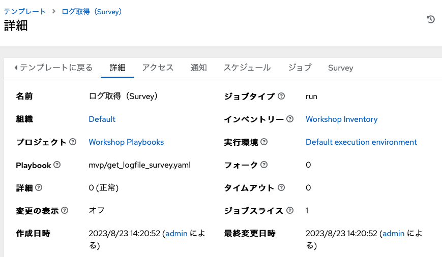
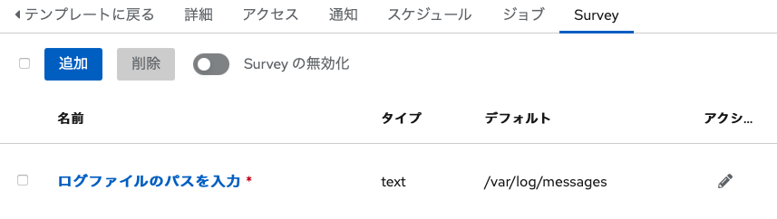
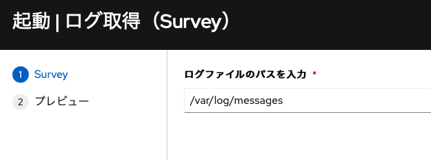
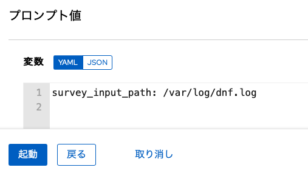
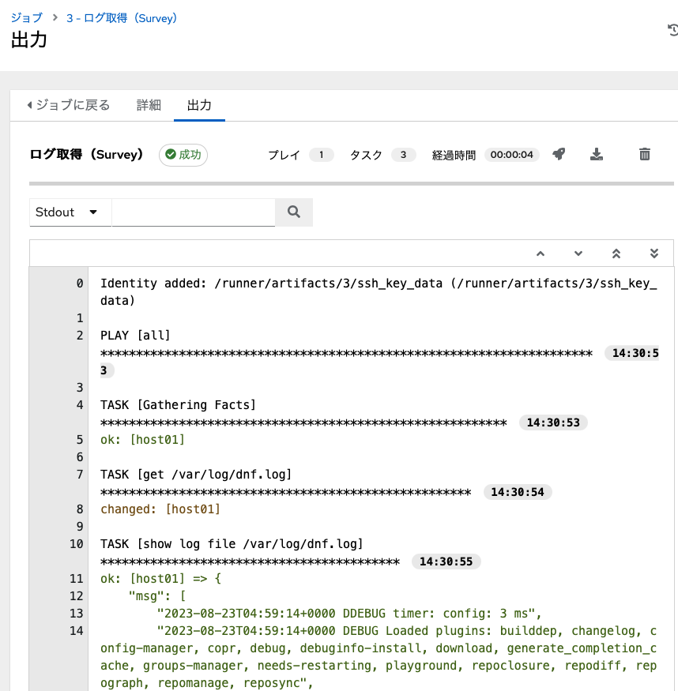

**<<自動化にパラメーターを与える>>**

以下の手順に従い、演習環境を進めてください。

> 左側のウインドのロードに少し時間がかかる場合があります。表示されるまで少々お待ち下さい。

↓をクリックすると次の手順が展開されます。

☑️ タスク1: Automation Controller へのログイン
===
演習画面の左上部のタブから `Dashboard` を選択し、Ansible Automation Platform のログイン画面を表示します。以下の情報でログインを行います。

ユーザー名：
```
admin
```

パスワード：
```
ansible123!
```

今後は、この Ansible Automaton Platform の画面を操作していきます。

> Note: 表示される画面の言語はブラウザの言語設定によって変わります。


☑️ タスク2: ジョブテンプレートの確認
===
演習用にジョブテンプレート「ログ取得（Survey）」が追加されています。まずはこのジョブテンプレートが存在することを確認してください。この時点ではまだSurveyは追加されていません。


このジョブテンプレートは以下のパラメーターで作成されています。

| 項目           | 設定値                        | 備考 |
|----------------|-------------------------------|------|
| 名前           | ログ取得（Survey）            |      |
| インベントリー | Workshop Inventory            |      |
| プロジェクト   | Workshop Playbooks            |      |
| Playbook       | mvp/get\_logfile\_survey.yaml |      |
| 認証情報       | Host01 Credential             |      |

`mvp/get_logfile_survey.yaml` は先のステップで作成した `get_logfile.yaml` に似ていますが、変数 `survey_input_path` の値を受け取り、この変数に格納されたパスのファイルを取得するように作られています。何も値を与えなかった場合はデフォルト値として `/var/log/messages` を使用します。

> 参考: [get\_logfile\_survey.yaml](https://github.com/irixjp/instruqt-playbooks/blob/main/mvp/get_logfile_survey.yaml)

Survey を設定する前にジョブテンプレート「ログ取得（Survey）」を実行してください。


この時点では何のパラメーターも渡されていないため、標準の `/var/log/messages` の内容が取得されるはずです。


☑️ タスク3: Survey の追加
===
それでは Survey を追加して、パラメーターを渡せるようにしていきます。

画面左側メニューの「リソース」配下の「テンプレート」をクリックし、定義済みのジョブテンプレートの一覧を表示してください。ここに「ログ取得（Survey）」が表示されているはずです。

表示されているジョブテンプレートの一覧では名前の部分がリンクになっていますので、「ログ取得（Survey）」をクリックしてジョブの詳細を表示してください。


複数の横並びのタブ「詳細」「アクセス」「通知」・・・が表示されますので、一番右の「`Survey`」をクリックします。



Survey 画面で 「追加」をクリックすると Survey を追加できます。以下のパラメーターで作成してください。

| 項目             | 設定値                   | 備考                     |
|------------------|--------------------------|--------------------------|
| 質問             | ログファイルのパスを入力 | ユーザーへの問いかけ文章 |
| 回答の変数名     | survey\_input\_path      | 回答内容を格納する変数   |
| 回答タイプ       | テキスト                 |                          |
| 必須             | （チェックを入れる）     |                          |
| デフォルトの応答 | /var/log/messages        |                          |

入力したら「保存」をクリックします。保存すると作成した Survey の一覧が表示されているはずです。



最後に Survey を有効化します。Survey の一覧画面の上部に「Survey 無効化」と表示されたスライダーがありますので、これをクリックして「Survey の有効化」の状態にしてください。


☑️ タスク4: ジョブテンプレートの実行
===
それでは Survey を追加したジョブテンプレート「ログ取得（Survey）」を実行してください。


実行するとウインドが起動し、入力画面が表示されます。



初期状態では先程作成したデフォルト値（/var/log/messages）が入力されています。ここに好きなログファイルのパスを入力してみましょう。

代表的なログの保存場所は以下になります。

- /var/log/boot.log
- /var/log/cron
- /var/log/dnf.log
- /var/log/secure

ログファイルのパスを入力したら「次へ」をクリックしてください。


入力値の確認画面が表示されるので、値を確認して問題がなければ「起動」をクリックします。これでジョブテンプレートに値が渡されて起動します。



ジョブの実行結果の画面で指定したログのが表示されれば成功です。

出力例：


☑️ まとめ
===
本演習では `Survey` 機能を利用して、ジョブテンプレートにパラメーターを渡しました。この機能を利用することでより汎用的な自動化が可能となり、Ansible Automation Controller の権限設定と組み合わせて簡易的なセルフサービスを実現することが可能となります。また、Survey で設定した内容は REST API でジョブテンプレート起動する際にも引数として渡すことが可能です。

次の演習では、作成したこれまでに作成したジョブテンプレートを連結してより大きな自動化を構築する方法について体験します。

