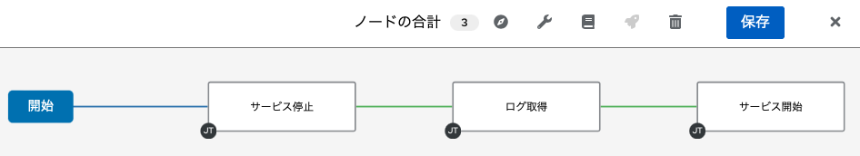

以下の手順に従い、演習環境を進めてください。

> 左側のウインドのロードに少し時間がかかる場合があります。表示されるまで少々お待ち下さい。

↓をクリックすると次の手順が展開されます。

☑️ タスク1: Automation Controller へのログイン
===
演習画面の左上部のタブから `Dashboard` を選択し、Ansible Automation Platform のログイン画面を表示します。以下の情報でログインを行います。

ユーザー名：
```
admin
```

パスワード：
```
ansible123!
```

今後は、この Ansible Automaton Platform の画面を操作していきます。

> Note: 表示される画面の言語はブラウザの言語設定によって変わります。


☑️ タスク2: ワークフローテンプレートの作成
===
「ワークフローテンプレート」を利用するとこれまでに作成したジョブテンプレートを連結して、より大きな自動化を構築するこができます。

この機能があるため、ジョブテンプレートは小さくて再利用しやすい単機能で作成しておき、それらをワークフローテンプレートで連結して業務に合わせた自動化を実現することができます。

それでは早速、「ワークフローテンプレート」を使って、これまでに作成したジョブテンプレートを連結して、「サービス停止」→「ログの取得」→「サービスの開始」という自動化を作成していきましょう。

1. 左メニューの「リソース」配下の「テンプレート」をクリックしテンプレートの一覧を表示します。

2. テンプレート一覧画面の上部の「Add」をクリックし「ワークフローテンプレートの追加」を選択して、ワークフローテンプレートの作成を開始します。


以下のパラメーターでワークフローテンプレートを作成してください。指示のないパラメーターについてはデフォルトのままにしてください。

| 項目 | 設定値                       | 備考     |
|------|------------------------------|----------|
| 名前 | サービスの再起動＆ログの取得 | ＆は全角 |
| 組織 | Default                      |          |

入力が環境したら「保存」を選択して保存します。設定を保存すると、ワークフローのエディタが起動しますので、次の作業はこちらから行っていきます。


☑️ タスク3: ワークフローの配置
===
ワークフローエディタを使って、ジョブテンプレートを連結していきます。まず最初に起動するジョブテンプレートを選択します。

1. エディタに表示されている「開始」をクリックしてください。

2. ジョブテンプレートの一覧が表示されますので、「サービスの停止」を選択します。

3. 最後に「保存」を選択します。

以下のような状態になるはずです。


次に、「サービスの停止」にマウスカーソルを合わせると、以下のようなメニューが表示されますので、「＋」ボタンを選択します。これで次の動かすジョブテンプレートを選択していきます。


起動した画面から「成功時」を選択して「次へ」をクリック、その後に「ログの取得」を選択して「保存」を行います。


すると以下の状態になるはずです。


続けて最後のジョブテンプレートを配置します。「ログの取得」にカーソルを合わせて「＋」を選択し、「成功時」を選択、最後に「サービスの開始」を選択して「保存」を選択します。

これでワークフローの完成です。



上記の状態になったら、画面右上の「保存」をクリックしてワークフローを保存します。これで作業は完了です。

☑️ タスク4: ワークフローテンプレートの起動
===
作成したワークフローテンプレートを起動し、3つのジョブテンプレートが順番に起動するかを確認していきます。

左メニューの「リソース」の「テンプレート」をクリックし、テンプレートの一覧を表示し、そこから「サービスの再起動＆ログの取得」を起動します。


上記のロケットアイコンをクリックしてワークフローテンプレートを起動します。


ワークフローテンプレートが起動すると以下のような画面が表示され、ジョブテンプレートが順番に起動していることが確認できます。


それぞれ個別のジョブテンプレートの実行結果を確認するには、配置されているジョブテンプレートのボックスをクリックすると、個別ジョブの実行結果が確認できます。

本演習は以上で終了となります。


☑️ まとめ
===
本演習では「ワークフローテンプレート」を使用して、作成済みのジョブテンプレートを連結してより大きな自動化を作成しました。ワークフローテンプレートを使用することで以下のメリットを得ることができます。

1. ジョブテンプレートを最小機能を備えた単機能として実装できる
2. 機能を連結して業務に適した自動化を構築できる
3. 自動化の再利用を容易にしてくれる

今回の演習ではジョブテンプレート同士の連結は「成功時」という条件を使用しましたが、他にも「障害発生時」「常時」なども利用できたり、複数の一つのジョブテンプレートの次に複数のジョブテンプレートを並列実行することも可能です。


