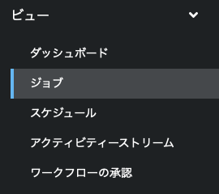

以下の手順に従い、演習環境を進めてください。

> 左側のウインドのロードに少し時間がかかる場合があります。表示されるまで少々お待ち下さい。

↓をクリックすると次の手順が展開されます。

☑️ タスク1: awx コマンドによるジョブテンプレートの起動
===
これまでに作成したテンプレートから起動してみましょう。

`Controller CLI` タブへ移動し、以下のコマンドを実行します。

```
awx -k --conf.host https://localhost/ --conf.username admin --conf.password ansible123! job_template launch --wait "ログ取得"
```

> Note: 上記のコマンドでは認証情報や接続先のAutomation Controllerの情報を直接コマンドのオプションとして指定していますが、これらの情報をファイルに保存してコマンド実行時には認証情報が見えない形式にすることも可能です。

このコマンドを実行したら、`Dashboard` タブへ移動し、左メニューの「ビュー」配下の「ジョブ」をクリックします。ここで実行したテンプレートの履歴を確認できます。



ジョブの履歴では「ログ取得」のジョブテンプレートが実行されたことが確認できるはずです。

ジョブの終了を確認したら、再び `Controller CLI` タブへ戻ってください。ジョブが終了するとコマンドも終了し、戻り値が表示されているはずです。

サンプル（抜粋）
```
{
     "job": 13,
     "ignored_fields": {},
     "id": 13,
     "type": "job",
     "url": "/api/v2/jobs/13/",
     "summary_fields": {
          "organization": {
               "id": 1,
               "name": "Default",
               "description": ""
          },
          "inventory": {
               "id": 2,
               "name": "Workshop Inventory",
               "description": "",
```

ここに含まれる情報を利用して、awx コマンドを使って詳細を取得することも可能となっています。

> Note: awx コマンドの詳細は[コマンドリファレンス](https://docs.ansible.com/automation-controller/latest/html/controllercli/index.html)をご確認ください。


☑️ タスク2: awx コマンドによるワークフローテンプレートの起動
===
同じ手順でワークフローテンプレートを起動してみましょう。

`Controller CLI` タブから以下のコマンドを実行します。
```
awx -k --conf.host https://localhost/ --conf.username admin --conf.password ansible123! workflow_job_templates launch --wait "サービスの再起動＆ログの取得"
```

起動したら `Dashboard` タブへと移動し、「Views」の「Jobs」からワークフローテンプレートが起動したことを確認してください。


☑️ まとめ
===
本演習では awx コマンドを利用して外部システムからテンプレートを起動する方法について紹介しました。この awx コマンドは Python のライブラリとしても利用可能となっておりますので、プログラムの中から import して利用することも可能です。また他の言語やcurlコマンドを利用する場合には、直接 REST APIを呼び出すことも可能です。

この連携は、チケットシステムとの連携でよく使用されます。チケットが発行され、チケットフローがあるところまで進んだら自動的にジョブテンプレートを実行するという方法です。このように自動化にAPIをつけることで、更に自動化の利用シーンを広げることが可能となります。


☑️ 演習の終了
===
以上で全ての演習は終了となります。お疲れ様でした。


