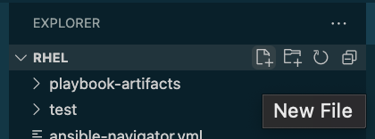
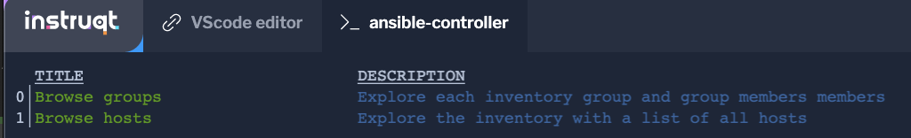

👋 はじめに
===
#### 所要時間: *3 分*<p>
初めての Ansible playbook の作成へようこそ。以下の課題とタスクでは、ネットワークデバイス用の Ansible プレイブックを書き始めるための作成プロセスを説明します。
この課題では、ansible-navigator について学び、ホスト一式のインベントリファイルを作成し、それらを *routers* というラベルの付いたグループにグループ化します。

☑️ 課題1 - Ansible Navigatorとは？
===

Ansible Navigatorは、Ansibleコンテンツを作成、レビュー、トラブルシューティングするためのコマンドベースのツールです。これには、インベントリ、プレイブック、およびコレクションが含まれます。

以下の課題では、`ansible-navigator`を使用してAnsibleプレイブックを実行します。

☑️ 課題2 - インベントリファイルの作成
===
* デフォルトでは *VScode editor* タブが開いています。

インベントリ・ファイルは、コントロール・マシンが管理するノードを指定するテキスト・ファイルです。管理するノードには、ノードのホスト名またはIPアドレスのリストを含めることができます。インベントリファイルでは、ホストグループ名を角括弧 ([]) で囲んで宣言することで、ノードをグループにまとめることができます。

`ansible-navigator.yml` ファイルにはこのラボを適切に実行するためのすべての設定が含まれています。自由に調査してください。ただし、変更はしないでください。

VScodeエディタのタブで、RHELディレクトリに`hosts`という名前のファイルを作成する。



hostsファイル内に以下の内容を記述する:

```
[routers]
cisco

[routers:vars]
ansible_connection=network_cli
ansible_network_os=ios
ansible_user=ansible
```

`hosts`ファイルの最初の部分で設定するのは、CSRルーターである`cisco`という名前の1つのネットワークデバイスを持つ`routers`という名前のグループである。後半では、ネットワークデバイスに接続するために必要な変数を設定します。ユーザ `ansible` を使用して、SSH 経由で（network_cli を選択して）IOS デバイスに接続することを指定します。このルータには IOSXE が搭載されており、`ansible_network_os` 変数が `ios` と等しい場合、両方の Cisco OS タイプに適合することに注意してください。

この例では、network_cli 接続プラグインを使用します。このプラグインの使用方法についてもっと詳しく知りたい場合は、[ドキュメント](https://docs.ansible.com/ansible/latest/collections/ansible/netcommon/network_cli_connection.html) を参照してください。

☑️ 課題3 - Ansible Navigatorの使い方は？
===

Ansible navigator デフォルトで対話型モードがあり、さまざまなオプションを調べることができます。このラボでは、`ansible-navigator` のモードを `stdout` に設定します。

*ansible-controller* タブ内で、以下のコマンドを実行して、インベントリ内で利用可能なもののリストを取得します:

```
ansible-navigator inventory --list
```

対応する番号をクリックすることで、オプションをナビゲートすることができます。例えば0をクリックすると`Browse groups`をチェックすることができ、1を選択すると`Browse hosts`をナビゲートすることができます。ESCキーでいつでも戻ることができます。



次の課題では、Ansibleのプレイブックを実行するための`ansible-navigator run`コマンドに慣れる。


✅ 次のチャレンジ
===
タスクを完了したら、下の`Check`ボタンを押して次のチャレンジに進んでください。

🐛 問題が発生しましたか？
====

問題が発生した場合、または何かおかしいと気づいた場合は [open an issue](https://github.com/ansible/instruqt/issues/new?labels=network-automation-playbook&title=Issue+with+Writing+First+Network+Playbook+playbook-inventory&assignees=dafmendo) を開いてください。

<style type="text/css" rel="stylesheet">
  .lightbox {
    display: none;
    position: fixed;
    justify-content: center;
    align-items: center;
    z-index: 999;
    top: 0;
    left: 0;
    right: 0;
    bottom: 0;
    padding: 1rem;
    background: rgba(0, 0, 0, 0.8);
    margin-left: auto;
    margin-right: auto;
    margin-top: auto;
    margin-bottom: auto;
  }
  .lightbox:target {
    display: flex;
  }
  .lightbox img {
    /* max-height: 100% */
    max-width: 60%;
    max-height: 60%;
  }
  img {
    display: block;
    margin-left: auto;
    margin-right: auto;
  }
  h1 {
    font-size: 18px;
  }
    h2 {
    font-size: 16px;
    font-weight: 600
  }
    h3 {
    font-size: 14px;
    font-weight: 600
  }
  p span {
    font-size: 14px;
  }
  ul li span {
    font-size: 14px
  }
</style>
