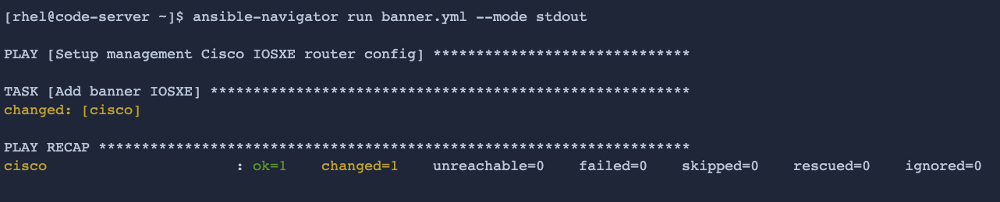
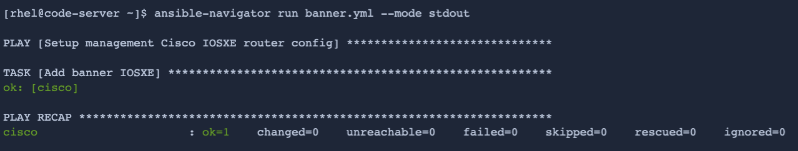
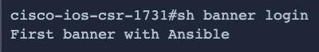
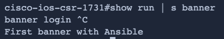

ステップ1
===

ansible-controller タブに切り替えて、Ansible Playbook を実行できるようにします。


ステップ2 - Ansible Playbookの実行
===

`ansible-navigator run` を使ってPlaybookを実行します。タスクは1つだけなので、-mode stdoutを使用します。

```
ansible-navigator run banner.yml --mode stdout
```
出力は以下のようになるはずです:



プレイブックを再実行することで、[冪等性](https://en.wikipedia.org/wiki/Idempotence) を確認することができます。

```
ansible-navigator run banner.yml --mode stdout
```

出力は以下のようになるはずです:



出力でわかるように、プレイブックを最初に実行したときのステータスはok=1、changed=1だった。これは、バナー・コンフィギュレーションがciscoホストに設定されているためです。

これはプレイブックの冪等性によるものです。つまり、playbookが2回目に実行されたとしても、変更はすでに設定されており、playbookが変更する必要はないためです（changed=0）。

ステップ3 - バナー設定の確認
===

Cisco スイッチにログインして、現在のバナー設定を確認する。

ansible-controller のターミナルから、`ssh cisco` を実行します。

```
ssh cisco
```

バナーの設定を調べるには、`show banner login` コマンドを使う:

```
show banner login
```

設定されたバナー情報が確認できます。



`show run | s banner` を使って、Cisco デバイスのバナーの実行設定を調べる:

```
show run | s banner
```



Ansible モジュールによって Cisco IOS-XEデバイスのコンフィグが実施されたことが確認できました。

✅ 次のチャレンジ
===
タスクを完了したら、下の `Check` ボタンを押して次のチャレンジに進んでください。

🐛  問題が発生しましたか？
====

問題が発生した場合、または何かおかしいと気づいた場合は、[open an issue](https://github.com/ansible/instruqt/issues/new?labels=network-automation-playbook&title=Issue+with+Writing+First+Network+Playbook+execute-banner-playbook&assignees=dafmendo) を開いてください。

<style type="text/css" rel="stylesheet">
  .lightbox {
    display: none;
    position: fixed;
    justify-content: center;
    align-items: center;
    z-index: 999;
    top: 0;
    left: 0;
    right: 0;
    bottom: 0;
    padding: 1rem;
    background: rgba(0, 0, 0, 0.8);
    margin-left: auto;
    margin-right: auto;
    margin-top: auto;
    margin-bottom: auto;
  }
  .lightbox:target {
    display: flex;
  }
  .lightbox img {
    /* max-height: 100% */
    max-width: 60%;
    max-height: 60%;
  }
  img {
    display: block;
    margin-left: auto;
    margin-right: auto;
  }
  h1 {
    font-size: 18px;
  }
    h2 {
    font-size: 16px;
    font-weight: 600
  }
    h3 {
    font-size: 14px;
    font-weight: 600
  }
  p span {
    font-size: 14px;
  }
  ul li span {
    font-size: 14px
  }
</style>
