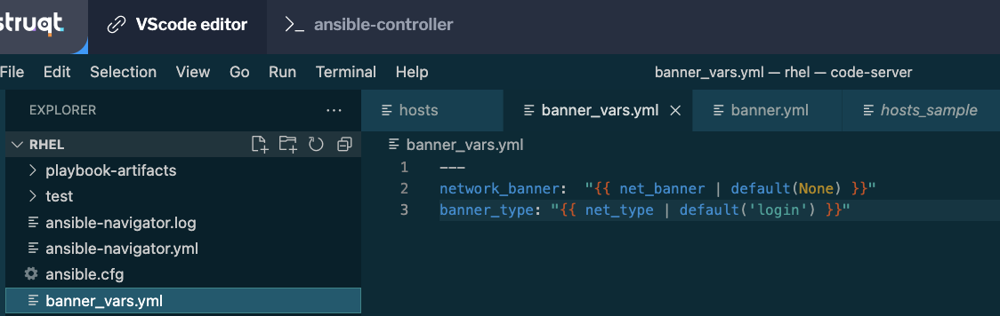
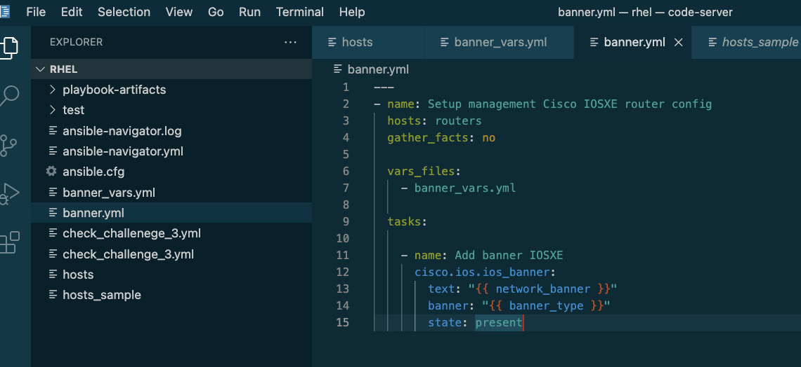

👋 はじめに
===
#### 予定所要時間: *10 分*<p>
プレイブックは動作していますが、バナーの種類と設定中のバナーには静的な値が設定されています。現実には、バナーを更新する必要があるかもしれませんし、ログインやMOTD（Message of the Day）バナーを設定したいかもしれません。

設定にオプションを与えるにはどうすればいいでしょうか？変数を使うことができます！


☑️ タスク1 - 変数をホストするbanner\_vars.ymlファイルの作成
===

このタスクでは、バナー変数を定義するファイルを作成します。VS Code タブから、`New file` を選択し、以下の値で `banner\_vars.yml` を作成する:

```
---
net_banner: "Second banner configured by Ansible"
net_type: "login"
```

ここで定義しているのは2つの変数です:
* `net\_banner`, 設定したい文字列を入力するために使用します、変数を定義しない場合、デフォルトはNoneとなる。
* `net\_type`, バナーの種類を定義します。一般的にはmotdかloginを選択します。もし変数を定義しなければ、loginが使われます。

新しいbanner\_vars.ymlファイルは次のようになります


☑️ タスク2 - 変数を使用するようにbanner.ymlファイルを更新する
===

banner.ymlプレイブックを開き、以下のプレイブックと一致するように編集します:

```
---
- name: Setup management Cisco IOSXE router config
  hosts: routers
  gather_facts: no

  vars_files:
    - banner_vars.yml

  tasks:
    - name: Add banner IOSXE
      cisco.ios.ios_banner:
        text: "{{ net_banner | default(None) }}"
        banner: "{{ net_type | default('login') }}"
        state: present
```

2種類の変更を加えることに注意してください:
* 入力変数を持つ `banner\_vars.yml` ファイルを呼び出すために vars_files セクションを追加する。
* `text` 変数と `banner` 変数を、`banner\_vars.yaml` で定義した変数を呼び出すように変更します、もし指定しなければ、デフォルト値になります。

更新されたbanner.ymlプレイブックは以下のようになります:



☑️ タスク3 - banner.yml プレイブックを実行する
===

*ansible-controller* タブで、playbookを実行する

```
ansible-navigator run banner.yml -m stdout
```

以下が期待されれる出力で、Playbookがホストに対して実行され、コンフィグの変更が行われたことが確認できます。:


☑️ タスク4 - 結果を検証する
===

Cisco ルーターにログインします。

```
ssh cisco
```

ログインするとバナーが変更されたことを確認できるはずです。これはコマンドで確認することも可能です:

```
show run | s banner
```

これでバナーのコンフィグが確認できました。

✅ 演習は終了です！
===

画面下の `Next` ボタンをクリックして演習を終了してください。


🐛 問題に遭遇しましたか？
===

問題が発生した場合、または何かおかしいと気づいた場合は [open an issue](https://github.com/ansible/instruqt/issues/new?labels=network-automation-playbook&title=Issue+with+Writing+First+Network+Playbook+add-variables&assignees=dafmendo) を開いてください。

<style type="text/css" rel="stylesheet">
  .lightbox {
    display: none;
    position: fixed;
    justify-content: center;
    align-items: center;
    z-index: 999;
    top: 0;
    left: 0;
    right: 0;
    bottom: 0;
    padding: 1rem;
    background: rgba(0, 0, 0, 0.8);
    margin-left: auto;
    margin-right: auto;
    margin-top: auto;
    margin-bottom: auto;
  }
  .lightbox:target {
    display: flex;
  }
  .lightbox img {
    /* max-height: 100% */
    max-width: 60%;
    max-height: 60%;
  }
  img {
    display: block;
    margin-left: auto;
    margin-right: auto;
  }
  h1 {
    font-size: 18px;
  }
    h2 {
    font-size: 16px;
    font-weight: 600
  }
    h3 {
    font-size: 14px;
    font-weight: 600
  }
  p span {
    font-size: 14px;
  }
  ul li span {
    font-size: 14px
  }
</style>
