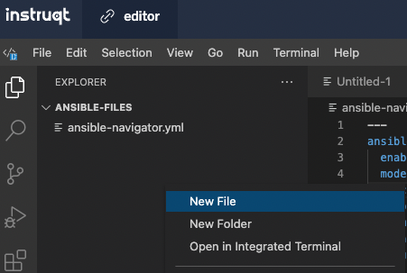

👋 はじめに
===
#### 所要時間: *3分*<p>
初めての Ansible Playbook の作成へようこそ。以下の課題とタスクでは、Ansible Playbook の作成を開始するための作成プロセスについて説明します。この課題では、ansible-navigator について学習し、一連のホストのインベントリーファイルを作成し、それらを *web* というラベルの付いたグループにまとめます。

☑️ タスク 1 - Ansible Navigator とは?
===

Ansible navigator は、Ansible コンテンツを作成、レビュー、およびトラブルシューティングするためのコマンドベースのツールです。これには、インベントリー、Playbook、およびコレクションが含まれます。

以下の課題では、`ansible-navigator` を使用して Ansible Playbook を実行します。

☑️ タスク 2 - インベントリーファイルの作成
===
* *editor* タブがデフォルトで開きます。

インベントリーファイルは、制御マシンによって管理されるノードを指定するテキストファイルです。管理対象のノードには、それらのノードのホスト名または IP アドレスのリストが含まれる場合があります。インベントリーファイルでは、ホストグループ名を角括弧 ([]) で宣言することにより、ノードをグループに編成できます。

左ペインに `ansible-files` というラベルの付いたフォルダーが 1 つ表示されます。このフォルダーには、インベントリーファイルと将来の Playbook が含まれます。

現在、`ansible-files` ディレクトリーに存在する 1 つのファイルは `ansible-navigator.yml` です。`ansible-navigator.yml` ファイルには、このラボを適切に実行するためのすべての設定が含まれています。自由に調査してください。変更は行わないでください。

エディタータブ内で、ディレクトリー `ansible-files` を開きます。そのディレクトリーで、右クリックしてファイル `hosts` を作成します。



ファイルホスト内で、次のコンテンツを指定します。

```
[web]
node1
node2
```

☑️ タスク 3 - Ansible Navigator の使用方法
===

Ansible navigator には、さまざまなオプションを探索できるインタラクティブモードがデフォルトで付属しています。このラボでは、`ansible-navigator` のモードを `stdout` に設定します。

*controll* タブ内で `ansible-files` ディレクトリーに移動し、次のコマンドを実行して、インベントリー内で利用可能なもののリストを取得します。次を実行します。

```
cd ansible-files
```

```
ansible-navigator inventory --list
```

`--list` が細かすぎる場合は、`--graph` のオプションを使用して、`--list` を要約したものを出力できます。

```
ansible-navigator inventory --graph
```

以下の課題では、Ansible Playbook を実行するための `ansible-navigator run` コマンドの使い方を学びます。


✅ 次の課題
===
以下の `Check` ボタンを押して、タスクが完了したら次のチャレンジに移動します。

🐛 問題が発生していますか ?
====

問題が発生した場合や、正しくない点に気付いた場合は、[open an issue](https://github.com/ansible/instruqt/issues/new?labels=writing-first-playbook&title=Issue+with+Writing+First+Playbook+slug+ID:+playbook-inventory&assignees=rlopez133)をクリックしてください。

<style type="text/css" rel="stylesheet">
  .lightbox {
    display: none;
    position: fixed;
    justify-content: center;
    align-items: center;
    z-index: 999;
    top: 0;
    left: 0;
    right: 0;
    bottom: 0;
    padding: 1rem;
    background: rgba(0, 0, 0, 0.8);
    margin-left: auto;
    margin-right: auto;
    margin-top: auto;
    margin-bottom: auto;
  }
  .lightbox:target {
    display: flex;
  }
  .lightbox img {
    /* max-height: 100% */
    max-width: 60%;
    max-height: 60%;
  }
  img {
    display: block;
    margin-left: auto;
    margin-right: auto;
  }
  h1 {
    font-size: 18px;
  }
    h2 {
    font-size: 16px;
    font-weight: 600
  }
    h3 {
    font-size: 14px;
    font-weight: 600
  }
  p span {
    font-size: 14px;
  }
  ul li span {
    font-size: 14px
  }
</style>
